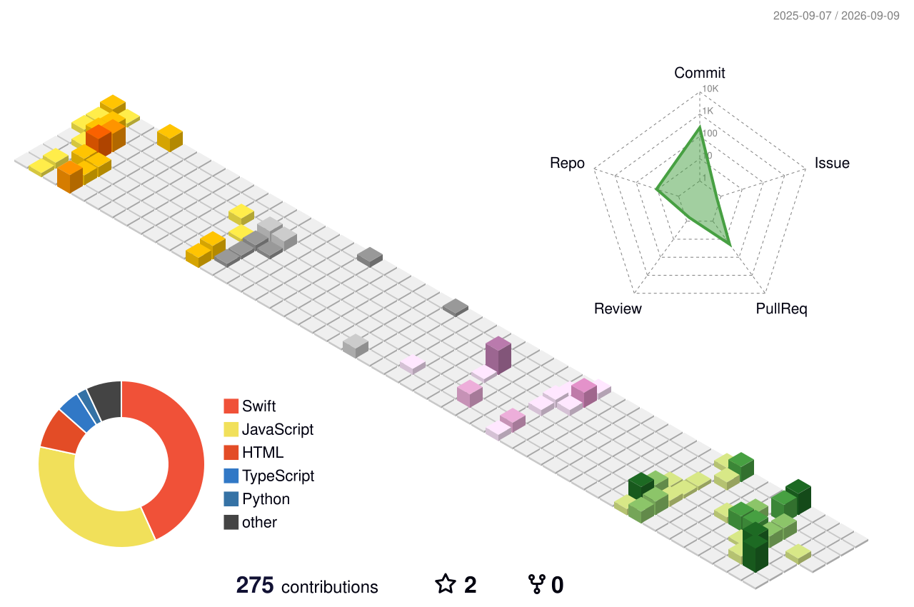

<picture>
  <source media="(prefers-color-scheme: dark)" srcset="banner-dark.svg">
  <source media="(prefers-color-scheme: light)" srcset="banner-light.svg">
  
</picture>

  <picture>
    <source media="(prefers-color-scheme: dark)" srcset="roles-dark.svg">
    <source media="(prefers-color-scheme: light)" srcset="roles-light.svg">
    
  </picture>

I build machine learning systems and the software around them — the model, the API, the interface, and the thing that finally gets deployed. Computer Science undergraduate at **BINUS University**, Research Assistant across NLP and computer vision, and currently in the **Apple Developer Academy** learning to ship on Apple platforms.

Most of what I enjoy sits at the seam: taking something that only worked in a notebook and making it survive contact with real users.

## Contents

[About](#stanley-pratama-teguh) · [whoami](#whoami) · [What I build](#what-i-build) · [Tools](#tools) · [By the numbers](#by-the-numbers) · [Selected work](#selected-work) · [Beyond the icons](#beyond-the-icons) · [Currently](#currently) · [Elsewhere](#elsewhere)

## whoami

  <picture>
    <source media="(prefers-color-scheme: dark)" srcset="terminal-dark.svg">
    <source media="(prefers-color-scheme: light)" srcset="terminal-light.svg">
    
  </picture>

## What I build

  <picture>
    <source media="(prefers-color-scheme: dark)" srcset="what-i-build-dark.svg">
    <source media="(prefers-color-scheme: light)" srcset="what-i-build-light.svg">
    
  </picture>

## Tools

  <picture>
    <source media="(prefers-color-scheme: dark)" srcset="https://skillicons.dev/icons?i=py,c,java,js,ts,swift,dart,php,tensorflow,pytorch,sklearn,react,nodejs,express,django,laravel,flutter,mongodb,mysql,git,github,vercel,figma&theme=dark&perline=12">
    <source media="(prefers-color-scheme: light)" srcset="https://skillicons.dev/icons?i=py,c,java,js,ts,swift,dart,php,tensorflow,pytorch,sklearn,react,nodejs,express,django,laravel,flutter,mongodb,mysql,git,github,vercel,figma&theme=light&perline=12">
    
  </picture>

  <picture>
    <source media="(prefers-color-scheme: dark)" srcset="marquee-dark.svg">
    <source media="(prefers-color-scheme: light)" srcset="marquee-light.svg">
    
  </picture>

## By the numbers

  <picture>
    <source media="(prefers-color-scheme: dark)" srcset="stats-dark.svg">
    <source media="(prefers-color-scheme: light)" srcset="stats-light.svg">
    
  </picture>

  <picture>
    <source media="(prefers-color-scheme: dark)" srcset="https://github-profile-summary-cards.vercel.app/api/cards/profile-details?username=LukasMystic&theme=github_dark&animation=load">
    <source media="(prefers-color-scheme: light)" srcset="https://github-profile-summary-cards.vercel.app/api/cards/profile-details?username=LukasMystic&theme=github&animation=load">
    
  </picture>

  <picture>
    <source media="(prefers-color-scheme: dark)" srcset="https://github-profile-summary-cards.vercel.app/api/cards/repos-per-language?username=LukasMystic&theme=github_dark&animation=draw">
    <source media="(prefers-color-scheme: light)" srcset="https://github-profile-summary-cards.vercel.app/api/cards/repos-per-language?username=LukasMystic&theme=github&animation=draw">
    
  </picture>
  <picture>
    <source media="(prefers-color-scheme: dark)" srcset="https://github-profile-summary-cards.vercel.app/api/cards/most-commit-language?username=LukasMystic&theme=github_dark&animation=draw">
    <source media="(prefers-color-scheme: light)" srcset="https://github-profile-summary-cards.vercel.app/api/cards/most-commit-language?username=LukasMystic&theme=github&animation=draw">
    
  </picture>

  <picture>
    <source media="(prefers-color-scheme: dark)" srcset="profile-3d-contrib/profile-night-view.svg">
    <source media="(prefers-color-scheme: light)" srcset="profile-3d-contrib/profile-season-animate.svg">
    
  </picture>

## Selected work

### AI and machine learning

| Project | What it does | Stack |
| --- | --- | --- |
| **[Political Sentiment AI](https://sentiment-analysis-llm.vercel.app)** | Scrapes YouTube and Reddit, labels multilingual sentiment, and has Llama-3 write a sourced report you can then question through a chatbot. A RAG layer keeps every claim traceable to a real post. | Python · Llama-3 · RAG · React · Node |
| **[DoodleDetect](https://github.com/jesslyntrixie/doodledetect)** | Sketch and image recognition from CLIP features, PCA and an SVM — beats a VGG-16 baseline with no retraining and no GPU loop. | CLIP · PCA · SVM · Tkinter |
| **[CeritaNusa](https://github.com/LukasMystic/ceritanusa)** | Android app that turns long Indonesian history material into short, accurate summaries, with a fine-tuned transformer behind a Django REST API. | Flutter · Django REST · Transformers |
| **[Cross-domain sentiment analysis](https://github.com/LukasMystic/Sentiment-Analysis)** | Sentiment on YouTube comments from the 2024 Indonesian presidential debate, compared across domains against quick-count results. | Python · scikit-learn |
| **[Stacking ensemble for sentiment](https://www.sciencedirect.com/science/article/pii/S1877050925027139)** | Research I led: a stacking ensemble that raises decision-tree accuracy on sentiment classification. Accepted at ICCSCI 2025, published in Elsevier Procedia Computer Science. | scikit-learn · TF-IDF · SMOTE |
| **[Building damage detection](https://stanleypt.vercel.app/project/68d419a9bbccb9a17094d400)** | Post-disaster segmentation and damage classification on Maxar satellite imagery, in a doctoral research team. 95.3% peak footprint accuracy. | TensorFlow · U-Net · Attention · SAM |
| **[Alzheimer's MRI benchmark](https://stanleypt.vercel.app/project/68d3e8037cabee5eb7243543)** | Five pre-trained CNNs benchmarked on the same MRI pipeline, weighing accuracy against compute cost and Grad-CAM explainability. | TensorFlow · EfficientNet · ResNet · Grad-CAM |

### Full-stack and web

| Project | What it does | Stack |
| --- | --- | --- |
| **[Reviving Wringinanom](https://github.com/LukasMystic/Project-Wringinanom)** | Tourism platform for Desa Wisata Wringinanom, built leading a team of 10 on a RAD cycle. Credited with an 8% rise in village tourism. | Web · RAD |
| **[HIMTI Bootcamp 2025](https://github.com/LukasMystic/HIMTIBOOTCAMP2025)** | Registration and participant-tracking platform for HIMTI's annual bootcamp. | MERN |
| **[LnT GitReady](https://github.com/LukasMystic/LnTGitReady)** | Workshop platform for BNCC's Learning and Training division. | TypeScript · React |
| **[BNCC final project](https://github.com/LukasMystic/BNCC-Final-Project)** | Back-end track final project — highest score in the region, and the only team to reach that level. | PHP · Laravel · MySQL |

Earlier coursework — AVL-tree data management in C, scientific computing labs — is in the repository list if you want to see where this started.

## Beyond the icons

The techniques that do not have a logo:

**Machine learning** &nbsp;`stacking ensembles` `SMOTE` `feature selection` `cross-validation` `Top-k accuracy & mAP`

**Deep learning** &nbsp;`U-Net` `attention modules` `transfer learning` `Grad-CAM` `EfficientNet / ResNet / VGG-16`

**NLP and LLMs** &nbsp;`transformer fine-tuning` `TF-IDF` `multilingual sentiment` `Meta-Llama-3` `RAG` `prompt engineering`

**Ways of working** &nbsp;`RAD` `Challenge-Based Learning` `research methodology` `academic writing`

## Currently

- Junior iOS Developer at the **Apple Developer Academy @ BINUS**, Cohort 9
- Research Assistant at **BINUS University** — NLP, computer vision, model evaluation
- Open to **AI/ML engineering, data science and full-stack** roles

## Elsewhere

  
  
  
  

<picture>
  <source media="(prefers-color-scheme: dark)" srcset="https://raw.githubusercontent.com/LukasMystic/LukasMystic/output/snake-dark.svg">
  <source media="(prefers-color-scheme: light)" srcset="https://raw.githubusercontent.com/LukasMystic/LukasMystic/output/snake.svg">
  
</picture>
